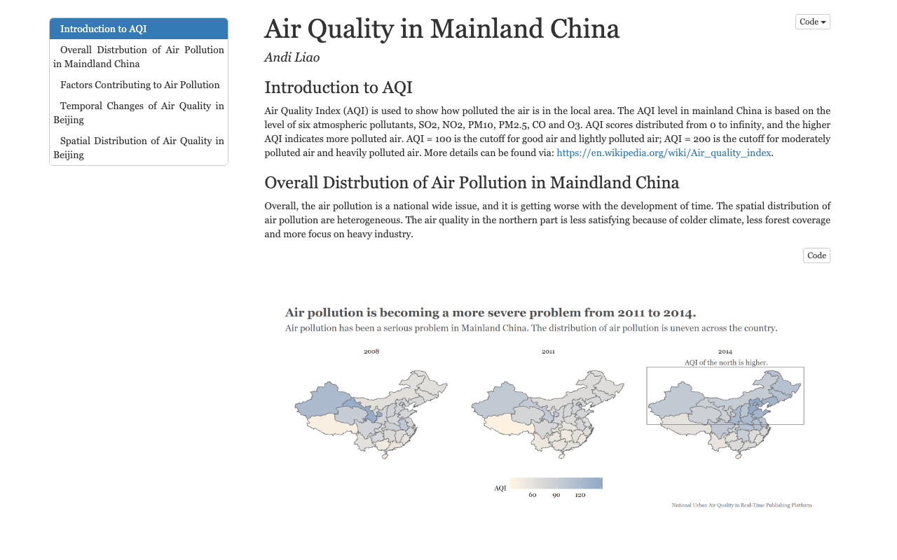

# Air Quality in Mainland China

A data visualization project exploring the relationship between environmental policy changes and air quality index (AQI) in mainland China.

Built with R, ggplot2, and GitHub Pages.

**[Live Demo](https://liaoandi.github.io/MainlandChina_AQI/)**

## Features

- National AQI distribution maps (2008, 2011, 2014) showing spatial variation
- Analysis of factors contributing to air pollution
- Temporal trends of air quality in Beijing
- Spatial distribution at city/district level

## Data Source

National Urban Air Quality Real-Time Publishing Platform
